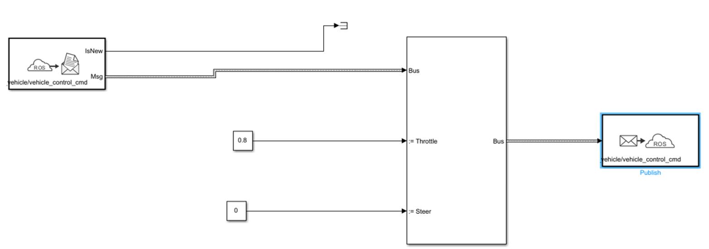

# Digital Twin Implementation of Sensor Fusion-Based ACC System for Autonomous Vehicles Using MATLAB and CARLA via ROS

## Overview


> **Note**: This README serves as a technical presentation of the project architecture and implementation. This is an academic  project demonstrating digital twin concepts for autonomous vehicle development using simulation-based testing.

This repository contains the implementation of an **Adaptive Cruise Control (ACC) system** based on multi-sensor fusion for autonomous vehicles. The system integrates data from multiple sensors including LiDAR, monocular camera, and depth camera to achieve robust environmental perception and safe vehicle control in simulated environments.


## Key Features

- **Multi-Sensor Fusion**: Combines LiDAR, camera, and depth sensor data for enhanced perception reliability
- **YOLO Object Detection**: Real-time vehicle detection using YOLOv4 for optimal speed-accuracy balance
- **Sensor Data Processing**: DBSCAN clustering for LiDAR data and ROI-based depth estimation
- **Advanced Control Systems**: 
  - Model Predictive Control (MPC) for longitudinal speed regulation
  - PI Controller for lateral steering control
- **Digital Twin Architecture**: Complete simulation environment using CARLA simulator
- **ROS Integration**: Real-time communication between MATLAB/Simulink and CARLA via ROS Bridge
- **Modular Design**: Clean separation of perception, control, and vehicle dynamics modules

## System Architecture

The system follows a modular digital twin architecture that separates perception, control, and simulation concerns. The architecture enables real-time interaction between MATLAB/Simulink control algorithms and the CARLA simulation environment through ROS middleware.

<p align="center">
  
</p>


The system is organized into two primary subsystems that form a closed control loop:

### 1. ACC with Sensor Fusion Module

This module handles environmental perception and speed control decisions. It processes multi-sensor data to maintain safe following distances while adapting to traffic conditions.
<p align="center">
  
</p>

#### Sensor Fusion Subsystem
The sensor fusion pipeline implements a decision-level fusion approach that combines heterogeneous sensor data:

<p align="center">
  
</p>

**Sensor Data Acquisition Layer:**

- **Camera Data Processing**: RGB images are processed through YOLOv4 object detection to identify vehicles and generate bounding boxes. Simultaneously, a depth camera provides complementary depth information through ROI-based processing within the detected bounding boxes.
- **LiDAR Data Processing**: Point cloud data undergoes DBSCAN clustering to detect objects and extract minimum distance measurements.
 these two sensors take the minimum distance between their respective measurements.

**Fusion Algorithm Layer:**

- **Detection Concatenation**: Standardizes heterogeneous detections into unified format with timestamps, measurements, and covariance matrices. The system derives prediction time from sensor_msgs/Image message headers to ensure temporal alignment of detections from different sensors. Detection format includes Time field, Measurement vector [x; y; z], 3×3 MeasurementNoise covariance matrix, SensorIndex, ObjectClassID, and ObjectAttributes struct. Bus structures are automatically initialized through initSimulinkParams.m script registered as PreLoadFcn callback.
- **Multi-Object Tracker**: Associates detections across time and sensors to maintain stable object tracks using the unified detection list from concatenation block. Implements sophisticated algorithms to maintain consistent object identities across multiple sensor measurements and time steps with different update rates. Handles asynchronous sensor inputs while managing sensor-specific measurement uncertainties and resolving multi-sensor detection conflicts. Outputs confirmed tracks list for downstream processing by lead vehicle selection algorithm.
- **Lead Vehicle Selection**: Identifies the Most Important Object (MIO) based on lane position and proximity using findLeadCar MATLAB function block. Determines which car is closest to ego vehicle and ahead in same lane using confirmed tracks list and road curvature information. Lead car designation changes dynamically when vehicles move into and out of the ego lane during driving scenarios. Function provides relative position, velocity of lead car to ego vehicle and index to most important object track.
  
#### ACC Controller Subsystem :

<p align="center">
  
</p>
The adaptive cruise control implements Model Predictive Control for longitudinal vehicle control, calculating required acceleration to maintain safe and smooth driving behavior. The system processes driver-set velocity, desired time gap, ego vehicle longitudinal velocity, relative distance to lead vehicle, and relative velocity to generate optimal control commands.
Control Strategy:

- **MPC Framework**: Optimizes control actions over finite prediction horizon balancing speed tracking, following distance maintenance, and passenger comfort
- **Constraint Handling**: Respects acceleration, deceleration, and comfort limits while ensuring smooth ride quality
- **Safety Margins**: Maintains minimum following distances under all conditions with adaptive safety buffers based on relative velocity

The ACC block balances driver preferences against real-time traffic dynamics, outputting single acceleration/deceleration signals for vehicle actuator control and enabling seamless transitions between speed regulation and car-following modes.


### 2. Vehicle Environment Module

This module simulates the physical vehicle response and environment interaction, completing the control feedback loop.

<p align="center">
  
</p>

#### 2.1 Vehicle Dynamics Subsystem :
Processes real-time odometry data from CARLA simulation:
- **State Estimation**: Extracts longitudinal velocity, lateral velocity, and yaw angle from nav_msgs/Odometry
- **Unit Conversion**: Converts m/s to km/h for automotive-standard representations
- **Real-time Feedback**: Provides current vehicle state to control algorithms

#### 2.2 Steering Control Subsystem :
The steering control subsystem implements lateral vehicle control for autonomous lane keeping using a dual-error correction approach.

**Control Architecture:**
The system uses a combined PI-P control law:
```
Steering = Kp·e1 + Ki·∫e1·dt + Kyaw·e2
```
**Control Components:**

- **Lateral Position Control (PI)**: Corrects vehicle deviation from desired path using proportional and integral gains
- **Heading Control (P)**: Aligns vehicle orientation with reference trajectory using yaw error feedback
  
**Gain Functions:**
  
- **Kp (Proportional)**: Immediate steering response to lateral deviation
- **Ki (Integral)**: Eliminates steady-state errors from disturbances
- **Kyaw: Vehicle**:  heading alignment for smooth trajectory following

The final steering command combines position correction and heading alignment to maintain accurate lane keeping with stable vehicle dynamics.

#### 2.3 Actors Subsystem :
Executes computed control commands by interfacing between the autonomous driving system and CARLA simulation environment through ROS communication protocols.

**Command Processing Pipeline:**
* **Command Formatting**: Converts control signals from ACC and steering subsystems to standardized ROS message format compatible with CARLA's vehicle control interface
* **Real-time Execution**: Publishes throttle and steering commands to CARLA simulation via `/carla/ego_vehicle/vehicle_control_cmd` ROS Publisher for immediate vehicle actuation
* **Synchronization**: Ensures control commands align with simulation timesteps to maintain temporal consistency between control computation and vehicle response

The control execution block receives throttle commands from the ACC longitudinal controller and steering commands from the lateral control subsystem, processes these through a Bus Selector to organize parameters, then publishes the integrated commands to CARLA environment, creating closed-loop vehicle control that translates high-level autonomous driving decisions into low-level vehicle actuator commands for simulation-based testing and validation.
### Communication Architecture

The system employs a distributed architecture with the following communication pattern:

```
CARLA Simulator ←→ ROS Bridge ←→ MATLAB/Simulink
    (UDP/TCP)         (TCP)         (ROS Toolbox)
```

- **CARLA-ROS Bridge**: Converts simulation data to ROS topics and control commands back to simulation
- **ROS Middleware**: Provides publish/subscribe messaging between perception and control modules
- **MATLAB ROS Toolbox**: Enables Simulink blocks to interface with ROS ecosystem
- **Real-time Synchronization**: Maintains temporal consistency across distributed components

## Implementation

The system implementation follows a systematic development approach using the V-Model methodology, ensuring rigorous testing at each development stage, starting with unit testing, followed by integration testing, system testing, and acceptance testing.

### Development Environment Setup

The implementation utilizes a unified development environment running on a single host machine:

- **Host System**: windows 11
- **Virtualization**: VMware running ROS Noetic for middleware operations
- **Simulation**: CARLA 0.9.13 with custom urban scenarios
- **Communication**: TCP/IP networking between host and VM
  
<p align="center">
  
</p>

### Key Implementation Components

#### 1. Sensor Data Acquisition Implementation
For testing, we evaluated camera and LiDAR depth detection capabilities under different weather conditions (sunny, rainy, foggy) with different fixed objects (passenger vehicle and motorcycle) at various distances (5m, 10m, 20m, 30m) to assess detection accuracy and reliability. 

<p align="center">
  
</p>

The testing results demonstrated good accuracy for both sensors within their operational ranges. LiDAR showed superior reliability and consistency across all weather conditions, maintaining accurate depth measurements regardless of atmospheric conditions. The camera provided comparable accuracy in optimal scenarios but showed some inconsistencies with smaller objects like motorcycles under certain conditions. Overall, both sensors delivered accurate and reliable depth measurements when detection was successful, and each has limitations which is why sensor fusion is applied to combine their complementary strengths for more robust autonomous driving performance.


#### 2. Sensor Fusion Algorithm


<p align="center">
  
</p>

The Detection Concatenation block was successfully tested through a unit test, yielding correct and reliable results. This block is responsible for combining detections from both the camera and LiDAR into a unified format, which is subsequently used as input for the Multi-Object Tracker. The following figures illustrate the structure of the concatenated detections that serve as inputs to the tracker.

<p align="center">
  
</p>  
 
In a subsequent step, the Multi-Object Tracker and the Lead Car Finder were also individually and successfully tested, demonstrating their ability to track multiple objects and identify the lead vehicle. After integrating all components, the complete pipeline was evaluated and found to be functional, delivering accurate and stable results tested in diffenrent wheather and object and it give the right result , as shown in Figure .

<p align="center">
  
</p>


#### 4. ACC Controller Implementation

<p align="center">
  
</p>

The results from the Adaptive Cruise Control (ACC) system were very promising. When 
tested with various input values, the system consistently produced logical and expected outputs,indicating that the control logic and sensor integration are functioning correctly. These 
outcomes validate the initial design and demonstrate the system’s ability to respond 
appropriately to real-world driving scenarios. 

#### 5. Vehicle Dynamics Integration


<p align="center">
  
</p>

The Vehicle Dynamics block is a key element of our CARLA-based test simulation. It processes real-time odometry data published on the ROS topic /carla/ego_vehicle/odometry (nav_msgs/Odometry). A Bus Selector isolates the relevant motion parameters longitudinal velocity, lateral velocity, and yaw angle used in adaptive simulation and control strategy development for autonomous driving. To ensure consistency with automotive standards, velocities are converted from m/s to km/h (×3.6). The block was thoroughly tested and validated, confirming accurate extraction and processing of vehicle motion data.

#### 6. Steering Control Implementation


<p align="center">
  
</p>

The automatic steering controller block was successfully tested to validate its core 
control logic. The objective was to verify that the block calculates a correct and logical steering 
command based on a given set of vehicle state and path inputs. Various test cases were 
configured to simulate the response of system. For example, in one test, the vehicle was given 
a longitudinal velocity of 10 m/s and a yaw angle error of 0.05 radians, while the lateral velocity 
and path curvature were set to 0, with a stop time of 0.2 seconds. This scenario represents a 
vehicle that is on the correct path but slightly angled to the left. As expected, the controller 
correctly identified the heading error and produced a negative steering value of approximately 
0.121, commanding a right turn to correct the vehicle's orientation. Additionally, when tested 
under ideal conditions with zero error inputs, the block correctly output a steering command of 
0. Overall, the test demonstrated that the steering controller block effectively processes 
dynamic inputs to generate appropriate corrective steering actions, confirming its readiness for 
integration into the autonomous driving system.

#### 7. Actors 

<p align="center">
  
</p>

The testing of actors block was successfully carried out without any issues. The 
objective was to verify the correct behavior of the ego vehicle in the CARLA simulation 
environment by manually assigning throttle and steering commands. The throttle input was 
varied between 0 and 1 to observe how it affects the vehicle's acceleration. When a low value 
such as 0.1 or 0.2 was applied, the vehicle moved forward slowly, indicating low acceleration. 
As the throttle was increased to higher values like 0.8 or 0.9, the vehicle responded with greater 
speed, confirming proper throttle functionality. When the throttle was set to 0, the vehicle came 
to a complete stop. For steering, values between -1 and 1 were tested. A value of 0 made the 
vehicle move straight ahead, while negative values caused the vehicle to steer left, and positive 
values resulted in a right turn. This confirmed that the system correctly interprets and applies 
steering commands. Overall, the test demonstrated that the block correctly sends throttle and 
steering commands to the CARLA simulator enabling accurate manual control of the ego 
vehicle.

